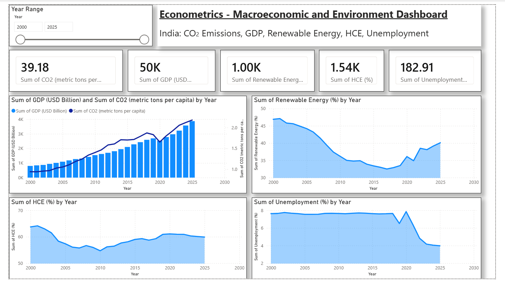

# India CO₂ Emissions & Macroeconomic Dashboard (Power BI)

A Power BI dashboard built for an econometrics project examining the relationship between
consumer spending and carbon emissions in India (2000–2025).

**Full report:** `Econometrics_Report.pdf`

**Team project** — Worked collaboratively across the data analysis, econometric modeling, and
dashboard design.

## Project background

**Report title:** *"The Relationship Between Consumer Spending and Carbon Emissions in India"*

The study used OLS regression and Granger causality analysis on 2000–2025 time-series data
to test whether household consumption expenditure (HCE) drives CO₂ emissions in India,
alongside GDP, unemployment, and renewable energy consumption as control variables.

**Key finding:** economic growth (GDP) is the primary driver of CO₂ emissions, and
renewable energy consumption significantly reduces them — while household consumption
expenditure alone did not show a statistically significant direct effect, though a weaker
indirect relationship emerged in causality testing.

## Dashboard

**Variables visualized:**
- Sum of CO₂ emissions (metric tons per capita)
- Sum of GDP (USD Billion)
- Sum of Renewable Energy (%)
- Sum of HCE — Household Consumption Expenditure (%)
- Sum of Unemployment (%)

**Features:**
- Year range slicer (2000–2025) filtering all visuals
- 5 KPI summary cards
- Dual-axis GDP vs CO₂ trend chart
- Individual time-series area charts for renewable energy, HCE, and unemployment

## Files

| File | Description |
|---|---|
| `Econometrics_Report.pdf` | Full written report — methodology, literature review, regression and causality results, conclusions |
| `Econometrics_Dashboard.pbix` | The Power BI file — requires Power BI Desktop to open and interact with |
| `Econometrics_Dashboard.xlsx` | Source data used to build the dashboard |
| `econometrics_dashboard.png` | Screenshot of the dashboard, for viewing directly on GitHub |
| `README.md` | This file |

